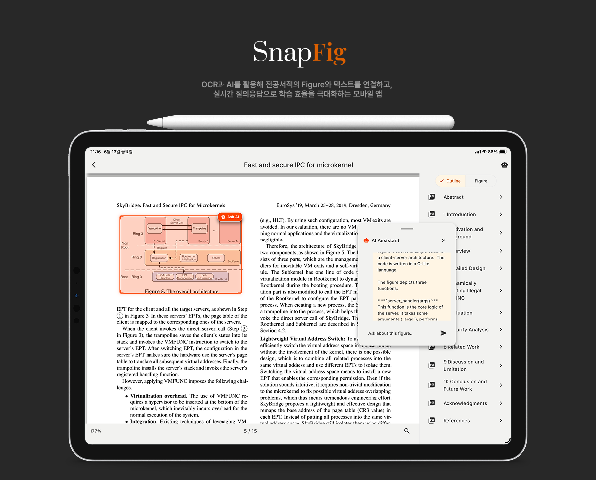

<div align="center">



[](https://flutter.dev)
[](docs/license.md)

***Snapfig*: PDF기반 학습 지원을 위한 플랫폼**

</div>

> **SnapFig**는 PDF에서 정보를 추출하고, AI 기반 분석·요약·질의응답·참조 매핑 등 기능을 제공합니다. 

---

## ✨ 주요 특징

- **AI 기반 문서 분석**: PDF, 이미지 등에서 텍스트·도표·주석 등 다양한 정보를 자동 추출
- **OCR 및 Figure 매핑**: OCR로 도표·참조를 인식하고, 텍스트와 그림을 자동 연결
- **실시간 질의응답**: 문서 내 특정 영역에 대해 AI에게 바로 질문 가능
- **모바일 앱 지원**: Flutter 기반 iOS/Android 앱 제공

---

## 🚀 빠른 시작

```bash
# 저장소 클론
git clone https://github.com/CommitBang/Snapfig.git
cd SnapFig

# 각 하위 디렉토리별 README 참고
cd frontend
# Flutter 앱 실행 예시
flutter pub get
flutter run

cd reference-mapper

# (권장) 원클릭 설치
python setup.py

# 또는 수동 설치
# conda create -n pdfrec python=3.9
# conda activate pdfrec
# pip install -r requirements.txt
# (선택) pip install paddlepaddle-gpu==3.0.0 -i https://www.paddlepaddle.org.cn/packages/stable/cu123/

# 서버 실행
python main.py
```

> 더 자세한 설치 및 실행법은 각 디렉토리의 README.md를 참고하세요.

---

## 🖼️ 활용 예시

- 전공서적, 논문 등에서 그림과 설명을 빠르게 연결해 학습
- 문서 내 도표·참조 자동 매핑 및 시각화
- AI 기반 요약, 질의응답으로 문서 이해도 향상
- 모바일 환경에서 실시간 문서 분석 및 학습 지원

---

## 📁 폴더 구조

자세한 설명은 [docs/folder_structure.md](docs/folder_structure.md) 참고

```
SnapFig/
├── frontend/             # Flutter 기반 모바일 앱 (iOS, Android)
├── reference-mapper/     # 백엔드 서비스 PDF 참조 매핑 및 OCR 서비스
├── backend/              # 백엔드 서비스 (AI, Gateway 등)
│   ├── ai_task_server/   # OCR 및 AI 요약 마이크로서비스
│   └── gateway_backend/  # PDF 분석, 주석, API 게이트웨이
├── docs/                 # 문서 및 가이드
└── README.md             # 메인 프로젝트 소개
```

---

## 📚 문서

- [폴더 구조](docs/folder_structure.md)
- [기여 가이드](docs/contributing.md)
- [라이선스 안내](docs/license.md)

---

## 🤝 기여

SnapFig는 오픈소스 프로젝트로, 누구나 기여할 수 있습니다.  
자세한 안내는 [docs/contributing.md](docs/contributing.md)를 참고하세요.

---

## 📝 라이선스

- **frontend**: MIT License
- **reference-mapper**: Apache License 2.0
- **backend/gateway_backend**: MIT License (README 명시)
- **backend/ai_task_server**: 별도 명시 없음

자세한 내용은 [docs/license.md](docs/license.md) 참고

---

문의 및 이슈는 GitHub Issue를 통해 남겨주세요.
